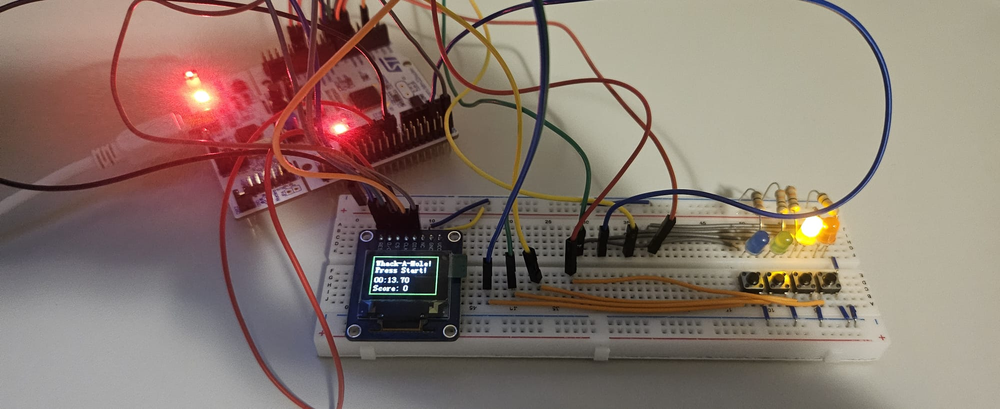

# whackamole-rtos
Whack‑A‑Mole with EXTI buttons, SPI SSD1331 OLED, message queue, timer callback, semaphores, and UART logging.

 small embedded game built in **under 3 hours** for the Spaceium engineering challenge.  
Runs on an **STM32F4 Nucleo** (F401RE/F411RE class) with **FreeRTOS**, an **SSD1331 OLED** via **SPI2**, **EXTI buttons** on `PA8..PA11`, and **UART2 (115200)** for logs.

> Core concepts: **multitasking**, **message queues**, **software timers**, **semaphores**, **GPIO interrupts**, and **SPI display I/O**.

The main firmware logic is located in [`main.c`](Embedded-Software-Engineer-SPACEIUM/Core/Src/main.c).

## 📸 Media

  

 Pin macros (e.g., `BLUE_LED_Pin`, `SSD1331_CS_Pin`) live in `main.h` (CubeMX). Adjust for your wiring.

---

📬 Contact
If you have any questions:
📧 badillouribeguillermoca@gmail.com

📄 License
This repository is licensed under the MIT License.
